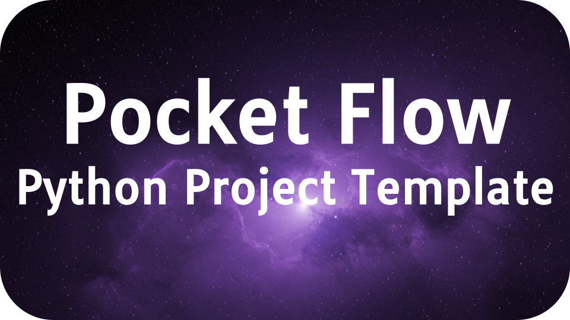

<h1 align="center">Pocket Flow - Cursor Project Template</h1>

  

    
This is a project template for [Pocket Flow](https://github.com/The-Pocket/PocketFlow), a 100-line LLM framework, with Cursor.

- We have included the [.cursorrules](.cursorrules) file to let Cursor AI help you build the project.
  
- Want to learn how to build the project with AI?
  
  - Check out the [LLM System Design Playbook](https://the-pocket.github.io/PocketFlow/guide.html)
    
  - Check out the [YouTube Tutorial](https://www.youtube.com/@ZacharyLLM?sub_confirmation=1)
