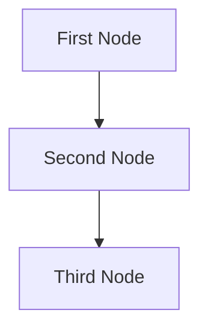

# Design Doc: Your Project Name

> Please DON'T remove notes for AI

## Requirements

> Notes for AI: Keep it simple and clear.

## Utility Functions

> Notes for AI:
> 1. Understand the utility functions thoroughly by reviewing the doc.
> 2. Only include a small number of the most important ones to start.

1. **Call LLM** (utils/call_llm.py)

## Flow Architecture

> Notes for AI:
> 1. Consider the design patterns of agent, map-reduce, rag, and workflow. Apply them if they fit.
> 2. Present a concise and high-level description of the workflow.

### Applicable Design Pattern:

1. Map the summary of the file into chunks, then reduce it into a final summary
2. Agentic file find

   - Context: the entire summary of the file
   - Action: find the file

### Flow high-level Design:

1. **First Node**: it is for ...
2. **Second Node**: it is for ...
3. **Third Node**: it is for ...



## Data Structure

### Shared Memory

> Notes for AI: Try to minimize data redundancy

The shared memory structure is organized as follows:

```python
shared = {
    "key": "value"
}
```

### Node Access Pattern

> Notes for AI: Carefully decide whether to use Batch/Async Node/Flow.

1. First Node
  - **Purpose**: Provide a short explanation of the node's function
  - **Design**: Decide between Regular, Batch, or Async
  - **Access Pattern**:
    - prep: Read "key" from the shared store
    - exec: Call utility function
    - post: Write "key" to the shared store

2. Second Node
  ...

