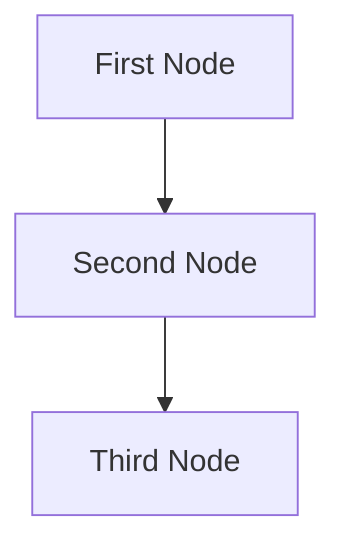

# Project Overview
> Please DON'T remove notes for AI

## Requirements
> Notes for AI: Keep it simple and clear.

## Utility Functions
> Notes for AI:
> 1. Understand the utility functions thoroughly by reviewing the doc.
> 2. Only include the most important functions to start.

1. **Call LLM** (`utils/call_llm.py`)

## Flow Architecture
> Notes for AI:
> 1. Consider the design patterns of agent, map-reduce, rag, and workflow. Apply them if they fit.
> 2. Present a concise and high-level description of the workflow.

1. **First Node**
2. **Second Node**
3. **Third Node**

### Flow Diagram
> Notes for AI: Carefully decide whether to use Batch/Async Node/Flow.



## Data Structure

The shared memory structure is organized as follows:

```python
shared = {
    "key": "value"
}
```

## Node Specifications

### 1. First Node
- **Purpose**: Provide a short explanation of the node’s function
- **Design**: Decide between Regular, Batch, Async
- **Data Access**:
  - Read: "key" from the shared store
  - Write: "key" to the shared store

### 2. Second Node
...

### 3. Third Node