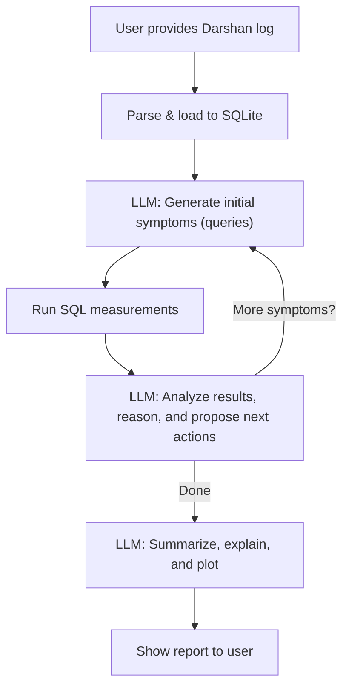
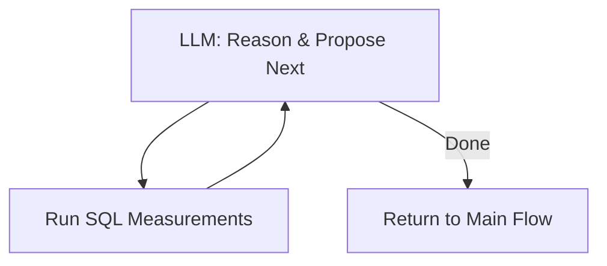

## Darshan Log I/O Inefficiency Agent: Iterative ReAct-Style Design

### 1. Requirements

**Goal:**
Help HPC application developers identify and understand I/O inefficiencies in their applications by analyzing Darshan log files. The agent should:
- Detect common and context-specific I/O inefficiency “symptoms” (e.g., small transfer sizes, excessive metadata ops).
- Explain each detected issue with context and actionable advice.
- Visualize problematic patterns for the user.

**User:**
HPC application developers and performance engineers.

**Problem:**
Darshan logs are rich but complex. Users need actionable, LLM-powered insights, not just raw stats.


### 2. Flow Design (Iterative ReAct Loop)

**High-Level Flow:**

1. **Input:** User provides a Darshan log file.
2. **Schema Extraction:** Parse the log and load it into a SQLite DB (with a known schema).
3. **Iterative Loop:**
    - a. **LLM proposes a set of symptoms** (title, description, SQL query) based on schema and previous findings.
    - b. **System runs the SQL measurements** and collects results.
    - c. **LLM observes the results** and reasons about them:
        - May propose new, refined, or follow-up symptoms/queries.
        - May decide the investigation is complete.
    - d. **Repeat** steps a–c until the LLM signals completion.
4. **Reporting:** Summarize findings, generate explanations, and create visualizations for the user.

**Flow Diagram:**



---

### 3. Utilities

- **Darshan Log Parser:** Converts Darshan log to SQLite DB (using existing tools or custom script).
- **SQL Runner:** Executes SQL queries and returns results.
- **LLM Wrapper:** For symptom generation, reasoning, and reporting.
- **Plotting Utility:** Generates plots (e.g., matplotlib, plotly) from SQL results.

---

### 4. Data Design

**Shared Store Example:**

```python
shared = {
    "darshan_log_path": "path/to/log",
    "sqlite_db_path": "path/to/db.sqlite",
    "schema": "...",  # SQL schema as string
    "symptom_history": [
        {
            "title": "Small Transfer Sizes",
            "description": "Frequent small I/O operations can hurt performance.",
            "sql": "SELECT ...",
            "result": {...},  # SQL result
            "judgment": {
                "is_warning": True,
                "explanation": "..."
            }
        },
        ...
    ],
    "report": {
        "summary": "...",
        "plots": [...],  # paths or data for plots
        "recommendations": "...",
    }
}
```

---

### 5. Node Design

| Node Name            | Type    | Reads from         | Writes to         | Utility Used         | Description |
|----------------------|---------|--------------------|-------------------|----------------------|-------------|
| ParseDarshanLog      | Regular | darshan_log_path   | sqlite_db_path    | darshan_parser       | Converts log to SQLite |
| IterativeSymptomLoop | Flow    | schema, history    | symptom_history   | LLM, sql_runner      | Iteratively proposes, measures, and reasons about symptoms |
| GenerateReport       | Regular | symptom_history    | report            | LLM, plotter         | LLM summarizes, explains, and plots |
| OutputReport         | Regular | report             |                   |                      | Presents report to user |

---

### 6. Implementation Plan

- Start with a minimal loop: parse log → LLM proposes one symptom → measure → LLM reasons → repeat or finish → report.
- Expand LLM reasoning and visualization capabilities iteratively.
- Add logging of the LLM’s “thought process” for transparency.

---

### 7. Optimization & Reliability

- Add more sophisticated symptom detection and reasoning over time.
- Allow user to provide custom symptoms or intervene in the loop.
- Add retries and error handling for LLM and SQL steps.
- Log all steps for debugging and reproducibility.

---

### 8. Internal Loop Start and Edge Case Handling

The internal loop of the `IterativeSymptomLoop` node always begins at the **LLM: Reason & Propose Next** step. This design ensures there is no special edge case for "no symptoms yet":

- On the first iteration, the LLM receives the schema and an empty history, and proposes the initial set of symptoms/queries.
- On subsequent iterations, the LLM sees the history of symptoms and their results, and can propose follow-ups, refinements, or decide to stop.
- The loop continues until the LLM signals that no further symptoms are needed.

**Internal Loop Diagram:**



**Summary:**
- The loop always starts at the reasoning step, so the LLM can handle both empty and non-empty histories naturally.
- There is no need for special handling of the "no symptoms yet" case; the LLM's reasoning is always the entry point.

---

**This section describes the iterative, agentic, ReAct-style design for Darshan log I/O inefficiency analysis.**

